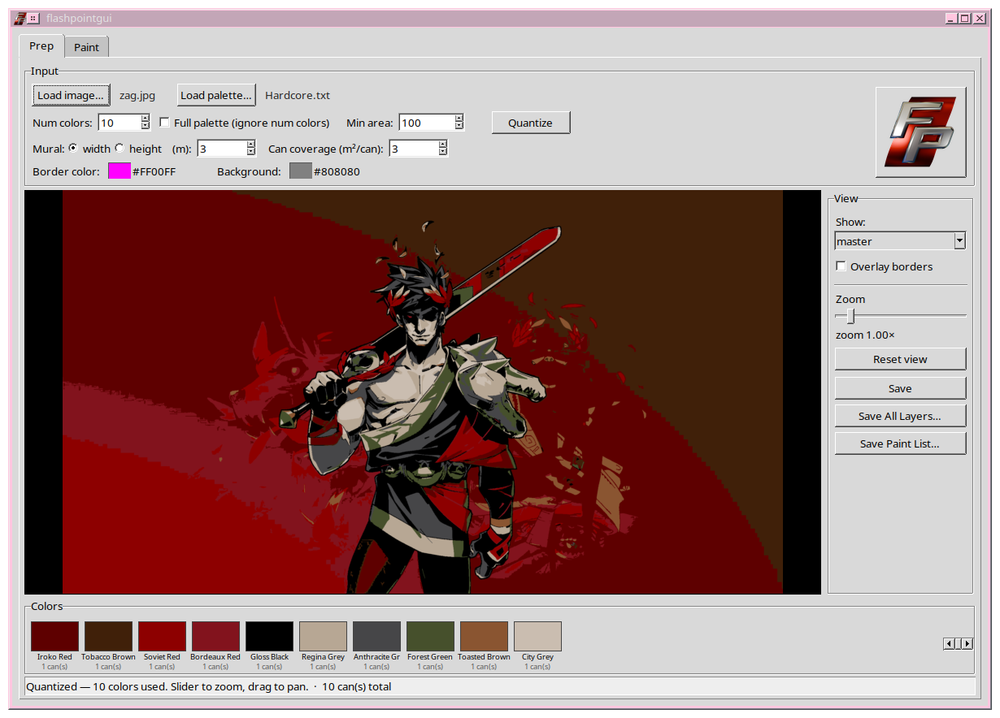
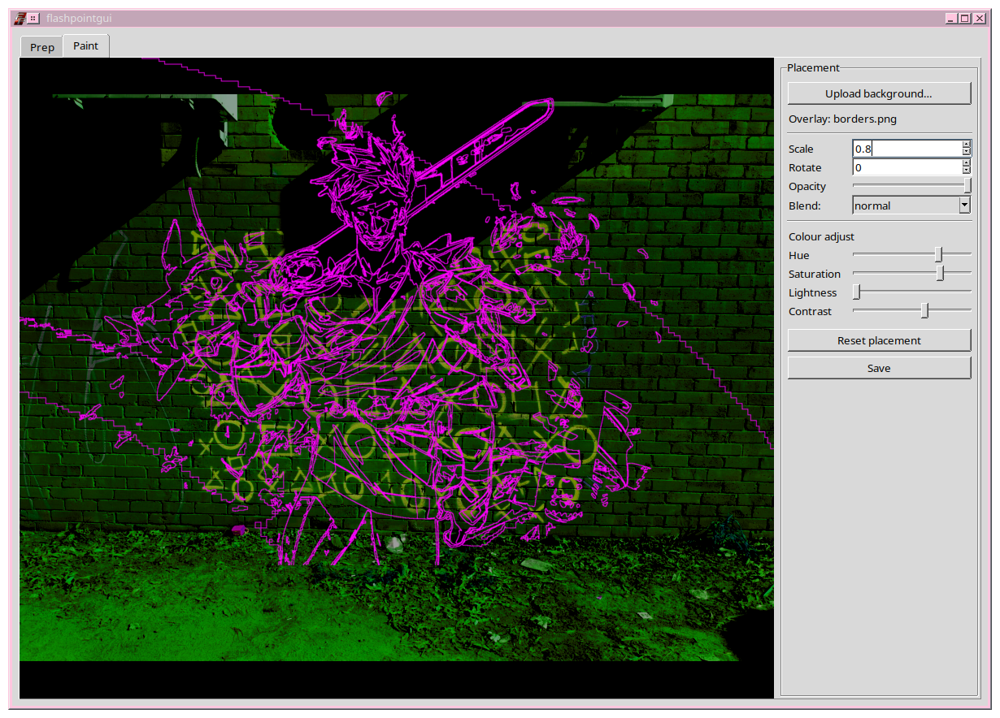
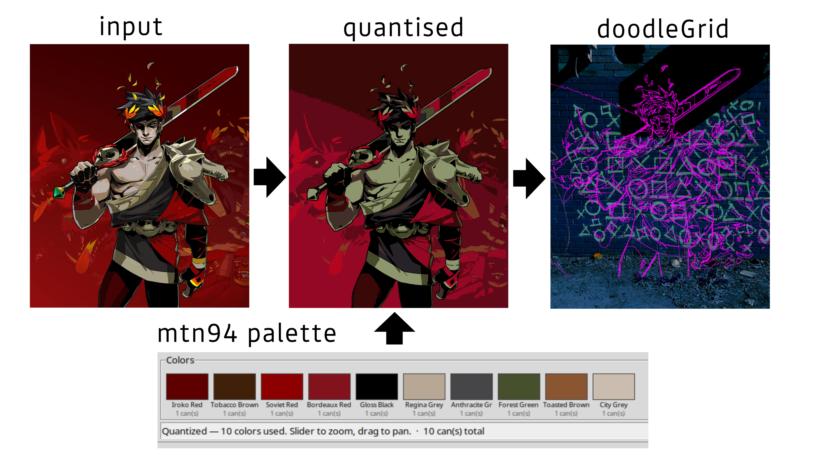

#  flashpointgui
flashpointgui is a GUI implementation of flashpoint, the Python-based palette-constrained posterizer used to assist mural painting with spray cans. The preparation environment lets you snap any image to any spray-can palette, get colour borders and fill areas to block in colours fast. The paint-list page helps you decide which colours to use and how many to buy. The paint environment lets you superimpose colour boundaries onto your doodle grid easily. <br>
Made by Saxon & Hypatia [Qwen3.8, Hermes]




flashpointgui painting mural pipeline:



## 📦 Install

To install the package (Debian/Ubuntu):

```bash
# system packages (Arch: python3-tk is already included, skip this line)
sudo apt install python3 python3-venv python3-tk git

# get the repo
cd ~
git clone https://github.com/saxononer/flashpointgui .flashpointgui
cd .flashpointgui

# virtualenv + Python dependencies
python3 -m venv .venv
.venv/bin/pip install -r requirements.txt

# put the launcher on your PATH
cp flashpointgui ~/.local/bin/
```

The repo includes `requirements.txt` (numpy, Pillow, scipy), the `flashpointgui` launcher script, and the `example/` images referenced above. The `flashpointgui` launcher needs to be committed (and be executable) for the last `cp` to work from a fresh clone — see "Notes" below.

## 👾 How to use

flashpointgui is a tool used to simplify the planning and painting of murals with spray cans. The application has 2 main environments, 'Prep' & 'Paint'. The Prep environment posterizes an input image to a desired number of colours from a spray-can palette. The Paint environment provides a lightweight compositor to overlay the colour boundary lines onto an image of your doodle grid.

The steps to use the application are as follows:

- **Load both input image & palette** <br>
Palette files are .txt files relating the names of spray paint colours to their HEX code equivalents. Paint manufacturers usually publish these values online. 3 palettes are provided in `palettes/` (`Hardcore.txt`, `LoopLP.txt`, `mtn_94.txt`).

- **Decide on settings.** <br>
Adjust the number of colours (the desired quantisation level) for the posterisation effect. The minimum area determines the smallest area of a quantised colour region. Decide the height/width of the mural and adjust the paint coverage constant (typical 400ml cans are considered to have a coverage of 3m²). These numbers are used to calculate the amount of cans of each colour required. <br>
The border and background colours can be adjusted for additional control.

- **Quantise the image** <br>
Click the quantise button and wait for the process to finish. A subtle 'Quantising...' prompt is shown at the bottom of the window to notify you of the current process. <br>
A quantized version of the image should populate the preview area, along with the specific colours of paint and can quantities used to create the mural. These colours can be edited live to plan colour variations. The drop-down in the view pane can further isolate layers for more control.

- **Paint the image** <br>
Load your doodle grid in the paint environment and overlay the colour boundary lines onto it, adjusting the border and background colours as needed.

## 🖥️ CLI usage

The program also has CLI functionality based on the following usage flags:

```bash
.venv/bin/python flashpoint.py \
  --input Hades.jpg \
  --palette palettes/Hardcore.txt \
  --output demo_hades \
```

### ⚙️ Flags

| Flag | Default | Meaning |
|---|---|---|
| `--input` | — | Source image (PNG or JPG). **Required.** |
| `--palette` | — | Palette file (`name, #rrggbb` per line). **Required.** |
| `--output` | — | Output directory (created if missing). **Required.** |
| `--num-colors N` | `10` | Cap the palette to the N dominant colours (nearest-N in Lab). |
| `--min-area N` | `50` | Regions smaller than N px are merged into a neighbour (`0` disables). |
| `--exact` | off | Use the full palette with no nearest-colour cap. |
| `--bg-color HEX` | `#808080` | Background behind colour regions in the layer PNGs. |
| `--border-color HEX` | `#ff00ff` | Stroke colour for the line-work — in `borders.png` and in every layer. |


## ❓ Script Information

It is a refactor of `flashpoint.py` split into three layers so the algorithm is testable and a GUI can sit on top of it:

| File | Role |
|------|------|
| `flashpoint_core.py` | The engine. `run_pipeline()` + the cheap `render_*` / `composite_over_photo` / `write_outputs` functions. Pure numpy/scipy/PIL — no UI. |
| `flashpoint_gui.py`  | The tkinter app. Live palette editing + camera-photo blend. |
| `flashpoint.py`      | Thin CLI wrapper — same command line as the original. |

### Notes

- **What needs to be committed:** the README references the `example/` images and the `flashpointgui` launcher script. For a fresh clone to render correctly and for the install's `cp flashpointgui ~/.local/bin/` step to work, both `example/` and the `flashpointgui` file must be `git add`ed and committed, and the launcher made executable (`chmod +x flashpointgui`).
- **Python version:** tested on Python 3.11+; `numpy`, `Pillow` and `scipy` come from `requirements.txt`.

[github.com/saxononer/flashpointgui](https://github.com/saxononer/flashpointgui)
